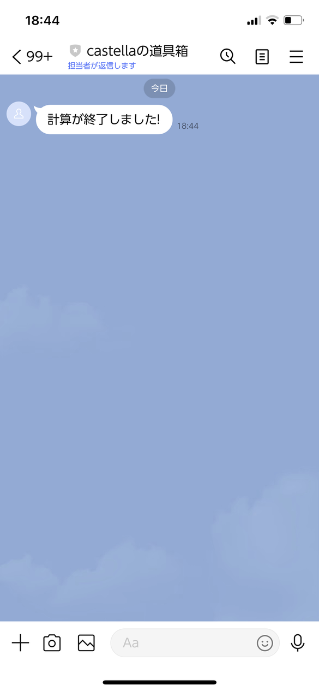
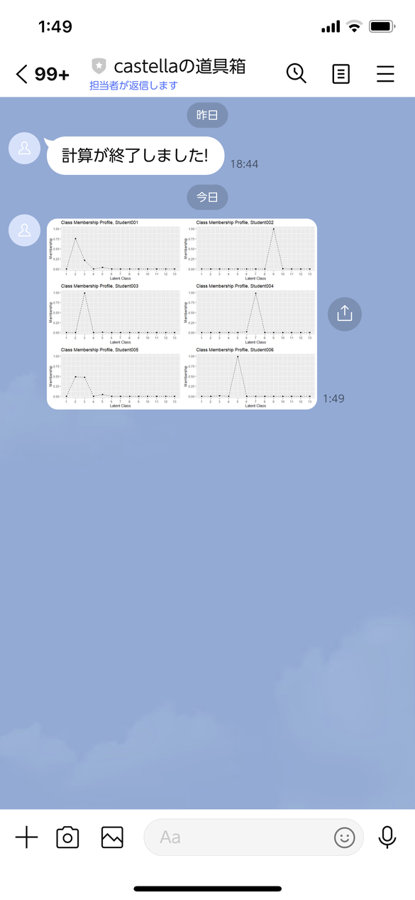

```{r setup, include=FALSE}
options(htmltools.dir.version = FALSE)
knitr::opts_chunk$set(echo = TRUE, warning = FALSE, message = FALSE)
```

class: middle

.pull-left.animate__animated.animate__fadeIn[
# 自己紹介

.card[
### カミムラダイチ (@dkamimura0)

- 心理学専攻の修士1年
- R歴4年くらい
]
]

.pull-right.animate__animated.animate__slideInRight[
.card[

]
]

---

# よくある悩み

.card.animate__animated.animate__fadeInUp[
### 長時間の計算作業での課題

- シミュレーションやStanでの計算が終わるまでPC前で待機
- 「もう終わったかな...」と何度も確認
- エラーが出ていたら...と不安
- 休憩もできず、作業効率が下がる
]

---
class: inverse, center, middle

# .animate__animated.animate__zoomIn[R×LINEで解決！]

---

# Rの計算結果をLINEへ通知

.pull-left[
.card.animate__animated.animate__slideInLeft[
### 通知の仕組み
<svg width="400" height="300" viewBox="0 0 400 300">
  <!-- RStudio Window -->
  <rect x="20" y="20" width="160" height="200" rx="10" fill="#ffffff" stroke="#cccccc" stroke-width="2"/>
  <rect x="20" y="20" width="160" height="30" rx="10" fill="#75aadb"/>
  <text x="30" y="40" font-family="sans-serif" font-size="14" fill="white">RStudio</text>
  
  <!-- Menu Bar -->
  <rect x="20" y="50" width="160" height="20" fill="#f5f5f5"/>
  <text x="25" y="64" font-family="sans-serif" font-size="10" fill="#333">File Edit Code View Help</text>
  
  <!-- Code Editor -->
  <rect x="25" y="75" width="150" height="140" fill="#ffffff" stroke="#e1e1e1" stroke-width="1"/>
  <text x="30" y="95" font-family="monospace" font-size="10" fill="#333">result <- long_calc()</text>
  <text x="30" y="115" font-family="monospace" font-size="10" fill="#333">send_line("計算開始")</text>
  <text x="30" y="135" font-family="monospace" font-size="10" fill="#333">if(is.error(result)) {</text>
  <text x="30" y="155" font-family="monospace" font-size="10" fill="#333">  send_line("エラー")</text>
  <text x="30" y="175" font-family="monospace" font-size="10" fill="#333">}</text>

  <!-- Flow Arrow -->
  <path d="M 190 120 L 240 120" stroke="#666666" stroke-width="3" marker-end="url(#arrow)"/>
  <text x="200" y="110" font-family="sans-serif" font-size="10" fill="#666666">計算結果</text>
  
  <!-- LINE App -->
  <rect x="250" y="20" width="120" height="200" rx="20" fill="#ffffff" stroke="#cccccc" stroke-width="2"/>
  <rect x="250" y="20" width="120" height="30" rx="20" fill="#00c300"/>
  <text x="290" y="40" font-family="sans-serif" font-size="14" fill="white">LINE</text>
  
  <!-- Messages -->
  <rect x="260" y="60" width="100" height="30" rx="10" fill="#00c300"/>
  <text x="270" y="80" font-family="sans-serif" font-size="10" fill="white">計算が完了しました！</text>
  
  <rect x="260" y="100" width="100" height="30" rx="10" fill="#00c300"/>
  <text x="270" y="120" font-family="sans-serif" font-size="10" fill="white">50% 完了</text>
  
  <rect x="260" y="140" width="100" height="30" rx="10" fill="#00c300"/>
  <text x="270" y="160" font-family="sans-serif" font-size="10" fill="white">エラーが発生</text>

  <defs>
    <marker id="arrow" markerWidth="10" markerHeight="7" refX="9" refY="3.5" orient="auto">
      <polygon points="0 0, 10 3.5, 0 7" fill="#666666"/>
    </marker>
  </defs>
</svg>
]]

.pull-right[
.card.animate__animated.animate__slideInRight[
### メリット
- リアルタイムで計算の状況を把握
- エラー発生時に即座に通知
- 進捗状況も定期的に確認可能
]]

---

# 実装方法

.card.animate__animated.animate__fadeInUp[
### 手順

1. LINE Developers APIの取得
   - LINE Developersに登録
   - チャネルの作成
   - アクセストークンの発行

2. Rでの実装
   ```r
   # メッセージ送信関数の定義
   send_line <- function(message) {
     url <- "https://api.line.me/v2/bot/message/broadcast"
     headers <- c(
       "Authorization" = paste("Bearer", channel_access_token),
       "Content-Type" = "application/json"
     )
     body <- list(messages = list(list(type = "text", text = message)))
     httr::POST(url, httr::add_headers(.headers = headers), body = body)
   }
   ```
]

---

# 活用例

.pull-left[
.card.animate__animated.animate__slideInLeft[
### メッセージの送信
```r
# エラー通知
tryCatch({
  result <- very_long_process()
  send_line("計算が完了しました！")
}, error = function(e) {
  send_line("エラーが発生しました")
})

# 進捗状況の通知
for(i in 1:100) {
  if(i %% 25 == 0) {
    send_line(paste0(i, "%完了"))
  }
}
```
]]

.pull-right[
.phone-card.animate__animated.animate__slideInRight[
### 実行結果

]]

---

# 活用例

.pull-left[
.card.animate__animated.animate__slideInLeft[
### 画像の送信
```r
send_image <- function(image_path) {
  url <- "https://api.line.me/v2/bot/message/broadcast"
  headers <- c(
    "Authorization" = paste("Bearer", token),
    "Content-Type" = "application/json"
  )
  body <- list(
    messages = list(list(
      type = "image",
      originalContentUrl = image_path,
      previewImageUrl = image_path
    ))
  )
  httr::POST(url, 
    httr::add_headers(.headers = headers), 
    body = body)
}
```
]]

.pull-right[
.phone-card.animate__animated.animate__slideInRight[
### 実行結果

]]

---

# こんな使い方ができる

.pull-left[
.card.animate__animated.animate__fadeInLeft[
### 場所を問わず結果等確認
- 電車での移動中に計算結果を確認
- 実験室を離れててもシミュレーションの完了を通知
- エラーが出たらすぐにLINEで通知
]]

.pull-right[
.card.animate__animated.animate__fadeInRight[
### 自動監視・通知
- 定期実行の分析結果をLINEで受け取る
- メモリ使用率が危険値を超えたら警告
]]

---
class: center, middle

# .animate__animated.animate__fadeIn[ご清聴ありがとうございました]
